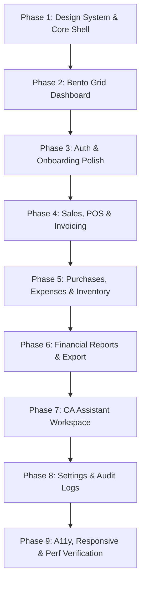

# TaskTally UI/UX Transformation Implementation Plan

**Project**: TaskTally Financial Management AI  
**Workspace**: `C:\AI project\financial-management-ai`  
**Role**: Lead Product Designer, UX Architect, and Senior Frontend Engineer  
**Status**: Ready for Review & Approval  
**Target Completion**: Phased Delivery (Phases 1 through 9)

---

## 1. Current Architecture & State Analysis

### 1.1 Technology Stack & Runtime
- **Framework**: Next.js 16.3.5 (App Router with Turbopack / Next dev conventions).
- **Core Libraries**: React 19.2.8, TypeScript 5, Tailwind CSS v4 (`@tailwindcss/postcss`).
- **Database & Data Layer**: PostgreSQL (Supabase) accessed via Prisma ORM 7 (`@prisma/client` 7.9.1, `@prisma/adapter-pg` 7.10.0). All financial figures utilize `Decimal.js` / Prisma `Decimal` for precision.
- **Authentication & RBAC**: Supabase Auth (SSR, PKCE) managed through server actions (`src/actions/auth.ts`) and session handling (`src/proxy.ts` / `src/lib/supabase/middleware.ts`). Strict multi-tenant isolation via `requireBusinessContext()`, `getUserBusinesses()`, `requireRole()`, and `requirePermission()`.
- **Iconography**: Lucide React (`lucide-react` 1.33.0).
- **Quality Baseline**: 227 passing unit/integration tests across 31 test suites (`vitest run`), 0 TypeScript errors (`tsc --noEmit`), 0 ESLint errors.

### 1.2 Frontend Deficiencies Identified in Audit
1. **Application Shell Absence & Partial Regressions**:
   - Existing pages (`/invoices`, `/customers`, `/products`, `/reports`, `/inventory`, etc.) currently contain ad-hoc page-level headers with disparate manual `<Link href="/dashboard">` back-buttons and divergent spacing (`min-h-screen p-6 max-w-7xl mx-auto space-y-8`).
   - The preliminary `Shell.tsx` component untracked in `src/components/layout/` indiscriminately wraps all routes, causing the sidebar and topbar to appear over unauthenticated `/login`, `/signup`, `/forgot-password`, and `/onboarding` screens.
2. **Dashboard Visual & Functional Limitations**:
   - The current dashboard at `src/app/dashboard/page.tsx` relies strictly on unformatted number cards and text dumps.
   - Zero charts or graphical trend indicators exist across the entire platform.
   - CA Assistant insights and real-time operational alerts (low stock, overdue receivables) are relegated to disconnected subpages rather than synthesized in an executive overview.
3. **Visual Inconsistencies & AI Aesthetic Traps**:
   - Reliance on saturated purple-to-indigo gradients (`bg-gradient-to-r from-indigo-600 to-purple-600`), heavy box shadows, and inconsistent rounded corners (`rounded-xl` mixed with `rounded-full`).
   - Inconsistent button styles, form input states, and status badge colors across pages.
4. **Accessibility & Responsive Shortcomings**:
   - Missing explicit ARIA landmarks (`<nav aria-label="...">`, `<aside>`, `<main>`), missing focus-visible rings for keyboard users, and missing `prefers-reduced-motion` guards on interactive transitions.
   - Tables overflow viewports without clear horizontal scroll indicators on small viewports (< 768px).

---

## 2. Design-System Adoption Plan

TaskTally will establish an authoritative, institutional-grade visual identity communicating:
**FINANCE + BUSINESS + AI + CONTROL**.

### 2.1 Color Tokens & Semantics
All colors are defined via Tailwind CSS v4 `@theme` and CSS custom variables in `src/app/globals.css`:
- **Canvas / Background**: `#0b0f19` (Deep Obsidian Blue-Black canvas, grounding the workspace with high contrast and zero eye fatigue).
- **Surface**: `#111827` (Card and panel backgrounds, 1px subtle borders `#1f2937` or `#374151/50`).
- **Surface Elevated**: `#1e293b` (Modals, popovers, floating menus, command bars).
- **Brand / Primary**: Professional Deep Indigo `#4f46e5` / `#6366f1` (Used deliberately for primary CTAs and active states, never for indiscriminate background washes).
- **Financial Status Semantics**:
  - `success` (Emerald `#10b981`, bg `#064e3b/30`, border `#059669/40`): Paid invoices, completed payments, positive cash flow.
  - `warning` (Amber `#f59e0b`, bg `#78350f/30`, border `#d97706/40`): Overdue notices, pending approvals, low stock thresholds.
  - `error` / `destructive` (Rose/Red `#ef4444`, bg `#7f1d1d/30`, border `#dc2626/40`): Critical alerts, failed transactions, cancelled invoices, stock depletion.
  - `info` (Sky/Blue `#3b82f6`, bg `#1e3a5f/30`, border `#2563eb/40`): Informational notices, draft status, upcoming scheduled actions.
  - `neutral` (Slate `#64748b` / `#94a3b8`, bg `#1e293b/50`, border `#334155/50`): Archived records, secondary metadata.

### 2.2 Typography Scale
Using `next/font/google` Geist Sans for text and JetBrains Mono for monetary and numeric tables:
- `text-xs` (12px / 16px line-height, font-medium): Status badges, table column headers, helper captions.
- `text-sm` (14px / 20px line-height, font-normal & font-medium): Body default, table cells, form labels, navigation items.
- `text-base` (16px / 24px line-height, font-normal): Lead paragraphs, input values, modal body text.
- `text-lg` (18px / 28px line-height, font-semibold): Card headings, section dividers.
- `text-xl` (20px / 28px line-height, font-semibold): Section titles, modal titles.
- `text-2xl` (24px / 32px line-height, font-bold): Page titles (`<h1>`), primary KPI headings.
- `text-3xl` / `text-4xl` (30px / 36px, font-mono font-extrabold): Primary financial metrics, hero values.
- Standard utility: `tabular-nums` applied globally to all currency, balance, quantity, and date displays to prevent layout jittering.

### 2.3 Spacing & Radius System
- Spacing: Strict 4px scale (`p-1` = 4px, `p-2` = 8px, `p-3` = 12px, `p-4` = 16px, `p-6` = 24px, `p-8` = 32px).
- Radius Scale:
  - `rounded-sm` (4px): Checkboxes, micro-tags.
  - `rounded-md` (8px): Inputs, buttons, dropdown items.
  - `rounded-lg` (12px): Standard cards, metric blocks, table wrappers.
  - `rounded-xl` (16px): Modals, bento overview cards, slide-overs.
  - `rounded-full`: Avatars, pill badges.
- Shadows: Restrained elevation (`shadow-sm`, `shadow-md`), avoiding muddy excessive shadows in dark mode.

---

## 3. Shell Implementation Plan

The persistent shell provides unified structure, navigation, workspace awareness, and breadcrumbs.

### 3.1 Route-Aware Layout Wrapping
The root layout (`src/app/layout.tsx`) supplies global fonts and providers, while `src/components/layout/Shell.tsx` intelligently evaluates the current path:
- **Public / Auth Routes** (`/login`, `/signup`, `/forgot-password`, `/reset-password`, `/onboarding`, `/auth/callback`):
  Render cleanly in an centered, focused authentication container with zero sidebar or topbar chrome.
- **Application Routes** (`/dashboard`, `/invoices`, `/pos`, `/customers`, `/products`, `/inventory`, `/purchases`, `/suppliers`, `/expenses`, `/payments`, `/reports`, `/ca-assistant`, `/settings`, `/audit-logs`, `/employees`):
  Wrapped inside the complete persistent desktop/mobile shell.

### 3.2 Responsive Sidebar (`src/components/layout/Sidebar.tsx`)
- **Desktop Expanded (w-64 / 256px)**: Brand logo, contextual workspace badge, grouped hierarchical navigation links with active state indicator (accent border + subtle surface tint), keyboard-accessible collapse toggle.
- **Desktop Collapsed (w-16 / 64px)**: Space-saving icon rail with tooltip previews on hover/focus.
- **Mobile Slide-Over (< 1024px)**: Off-canvas drawer activated via hamburger button, trapped focus, accessible backdrop overlay, and automatic route-change dismissal.
- **Logical Navigation Structure**:
  1. *Executive*: Dashboard (`/dashboard`)
  2. *Sales & Billing*: Invoices (`/invoices`), Point of Sale (`/pos`), Customers (`/customers`), Payments (`/payments`)
  3. *Purchases & Stock*: Purchases (`/purchases`), Suppliers (`/suppliers`), Inventory (`/inventory`), Products (`/products`), Expenses (`/expenses`)
  4. *Intelligence & Compliance*: Reports (`/reports`), Audit Logs (`/audit-logs`), CA Assistant (`/ca-assistant`)
  5. *Administration*: Settings (`/settings`), Team (`/employees`)

### 3.3 TopBar (`src/components/layout/TopBar.tsx`) & Breadcrumbs
- Sticky header (`h-16`) with glassmorphism backdrop blur (`backdrop-blur-md bg-[#111827]/80`).
- Left Section: Mobile hamburger trigger, dynamic breadcrumbs (`Breadcrumb.tsx`) showing current section and page hierarchy (e.g. `Dashboard > Invoices > INV-0042`).
- Right Section:
  - Business Switcher (`BusinessSwitcher.tsx`) for immediate multi-tenant switching.
  - Role Badge (e.g., `OWNER Access`, `ADMIN`, `STAFF`).
  - Notification/Alert quick-popover trigger.
  - User profile menu with fast Logout action.

---

## 4. Dashboard / Bento Implementation Plan

The dashboard at `src/app/dashboard/page.tsx` will be restructured as an executive Bento Grid that delivers immediate clarity.

### 4.1 Bento Layout Grid Blueprint (12-Column Desktop Grid)
```
┌─────────────────────────────────────────────────────────────────────────────┐
│ Header: Business Name & Currency | Date Range Selector | Primary Actions    │
├──────────────────────────────────────┬──────────────────────────────────────┤
│ Zone 1A: Total Revenue & Trend       │ Zone 1B: Cash & Collection Health    │
│ [col-span-12 lg:col-span-6]          │ [col-span-12 lg:col-span-6]          │
│ - Filtered Sales vs All-Time         │ - Collections in period              │
│ - Average ticket size & count        │ - Outstanding Customer Receivables   │
├──────────────────────────────────────┼──────────────────────────────────────┤
│ Zone 2A: Revenue vs Cash Trend Line  │ Zone 2B: Financial Snapshot Balance  │
│ [col-span-12 lg:col-span-8]          │ [col-span-12 lg:col-span-4]          │
│ - High-resolution trend chart        │ - Inventory Valuation (Weighted Avg) │
│ - Daily/Weekly revenue intervals     │ - Paid vs Partial vs Unpaid Invoices │
├──────────────────────────────────────┼──────────────────────────────────────┤
│ Zone 3A: Operational Quick Actions   │ Zone 3B: Proactive Risk & Alerts     │
│ [col-span-12 md:col-span-5]          │ [col-span-12 md:col-span-7]          │
│ - [+ Issue Invoice] (Primary)        │ - ⚠ Low Stock Alert Items            │
│ - [+ Record Payment]                 │ - ⚠ Overdue Invoices Requiring Follow│
│ - [+ Stock In] / [+ Add Product]     │ - 🔵 Compliance & Tax Status Summary │
├──────────────────────────────────────┴──────────────────────────────────────┤
│ Zone 4: CA Copilot Contextual Intelligence                                  │
│ [col-span-12]                                                               │
│ - Real-time AI financial synthesis based on active ledger aggregations      │
│ - Status badges: INFO / SUGGESTION / ACTION PREVIEW (Non-destructive)       │
│ - Quick prompt launcher into `/ca-assistant`                                │
└─────────────────────────────────────────────────────────────────────────────┘
```

### 4.2 Data Integrity Guarantee
- Retain all existing Prisma aggregations from `src/app/dashboard/page.tsx` (`totalSales`, `filteredSales`, `totalPayments`, `filteredPayments`, `outstandingReceivables`, `inventoryValuation`, `lowStockCount`).
- Zero mocked or synthetic financial figures: all numbers originate strictly from the authenticated tenant's database records.
- Complete support for date ranges (`today`, `this-week`, `this-month`, `this-year`, `all-time`).

---

## 5. Component Reuse & Primitives Plan

Centralize all shared presentation components in `src/components/ui/` with strict TypeScript props, eliminating one-off duplicated styles:

| Component | Path | Responsibility |
|---|---|---|
| `Button` | `src/components/ui/Button.tsx` | Variants (`primary`, `secondary`, `ghost`, `danger`, `outline`), loading spinner, icon slot, full keyboard accessibility. |
| `Input` | `src/components/ui/Input.tsx` | Standardized text, date, number, and search inputs with error ring and helper text. |
| `FormField` | `src/components/ui/FormField.tsx` | Accessible label, input slot, error message binding via `aria-describedby`. |
| `Card` | `src/components/ui/Card.tsx` | Base container with customizable padding, border tokens, and hover states. |
| `MetricCard` | `src/components/ui/MetricCard.tsx` | Specialized Bento metric card with label, value, trend indicator, and sparkline slot. |
| `Badge` | `src/components/ui/Badge.tsx` | Standard status pill with semantic color mappings (`success`, `warning`, `error`, `info`, `neutral`). |
| `Alert` | `src/components/ui/Alert.tsx` | Callouts for warnings, errors, and system notices with matching icons. |
| `Skeleton` | `src/components/ui/Skeleton.tsx` | Shimmer placeholder preserving exact layout dimensions during loading states. |
| `EmptyState` | `src/components/ui/EmptyState.tsx` | Helpful empty screen guidance with contextual icon, description, and primary CTA. |
| `ErrorBoundary`| `src/components/ui/ErrorBoundary.tsx` | Client error boundary catching unexpected exceptions with a clean retry action. |
| `ErrorDisplay` | `src/components/ui/ErrorDisplay.tsx` | User-friendly inline error messaging concealing raw stack traces or internal DB details. |

---

## 6. Responsive Implementation Plan

- **Mobile Viewport (320px - 639px)**:
  - Navigation: Sidebar collapses completely into an off-canvas drawer triggered by TopBar hamburger.
  - Bento Dashboard: Re-stacks vertically into single-column cards (`col-span-12`), preserving visual hierarchy.
  - Quick Actions: Touch-friendly 48px tap targets in a 2x2 grid.
  - Data Tables: Wrapped in horizontal scroll container with visual gradient fade indicating overflow.
- **Tablet Viewport (640px - 1023px)**:
  - 2-column grid layout with collapsible icon sidebar.
  - Quick stats display in 2x2 matrix.
- **Desktop Viewport (1024px - 1439px)**:
  - Full sidebar (256px) with multi-column Bento grid.
- **Widescreen Desktop (1440px+)**:
  - Max container width (`max-w-7xl` or `max-w-[1600px]`) centered with balanced whitespace.

---

## 7. Accessibility Plan (WCAG 2.2 AA Target)

1. **Semantic HTML**:
   - Explicit landmarks: `<header role="banner">`, `<aside aria-label="Sidebar navigation">`, `<nav aria-label="Main">`, `<main id="main-content">`.
   - Single `<h1>` per page, followed by strictly hierarchical `<h2>`, `<h3>` headings.
2. **Keyboard Navigation & Focus Management**:
   - High-contrast visible focus rings (`focus-visible:outline-none focus-visible:ring-2 focus-visible:ring-indigo-500 focus-visible:ring-offset-2 focus-visible:ring-offset-[#0b0f19]`).
   - Modal dialogs trap focus and close on `Escape`.
   - Skip-to-content link for screen-reader and keyboard users.
3. **Labels & ARIA**:
   - All icon-only buttons (collapse button, mobile menu toggle, search icons) include explicit `aria-label`.
   - Form controls have corresponding `<label htmlFor="...">` and `aria-invalid` / `aria-describedby` error bindings.
4. **Motion & Contrast**:
   - Full support for `prefers-reduced-motion`: animation duration reduced to 0.01ms for users requesting reduced motion.
   - Text contrast ratio exceeds 4.5:1 for normal text and 3:1 for large display headers against dark backgrounds.

---

## 8. Performance Plan

1. **Server Components by Default**:
   - Keep page-level data fetching (Dashboard, Invoices, Customers, Reports) on the server to prevent shipping database query bundles to the client.
   - Restrict `"use client"` exclusively to interactive controls (`Sidebar`, `TopBar`, `Dialog`, `BusinessSwitcher`).
2. **Zero Dependency Bloat**:
   - Implement clean SVG-based sparklines and trend charts without installing heavy 500KB chart libraries.
   - Use standard Tailwind utility transitions rather than heavy animation engines.
3. **Layout Stability (CLS = 0)**:
   - Provide exact height and width constraints on skeleton loaders and metric cards to eliminate Cumulative Layout Shift during page hydration.
4. **Verification via Chrome DevTools & Web Vitals**:
   - Measure LCP (< 2.0s), CLS (< 0.1), and INP (< 200ms) on desktop and emulated mobile networks.

---

## 9. Comprehensive Test Strategy

1. **Automated Unit & Regression Tests**:
   - Run existing Vitest suite (`npm test`) before and after each phase to guarantee 227/227 tests remain green.
   - Add component unit tests for UI primitives (`Button.test.tsx`, `Badge.test.tsx`, `FormField.test.tsx`, `Card.test.tsx`).
2. **Type Safety & Linting**:
   - Continuous verification with `npx tsc --noEmit` and `npm run lint`.
3. **Browser Runtime Verification**:
   - Real browser testing with Playwright MCP to verify:
     - Sidebar collapse/expand toggle and route navigation.
     - Mobile drawer opening and closing.
     - Dashboard Bento grid rendering across 375px, 768px, 1280px viewports.
     - Authentication route isolation (ensuring no sidebar on `/login` or `/signup`).
4. **Chrome DevTools MCP Inspection**:
   - Console message monitoring for zero hydration mismatches, zero missing key warnings, and zero uncaught promises.

---

## 10. Phased Implementation Roadmap



### Phase Details:
- **Phase 1: Design System & Core Shell (Current Immediate Scope)**:
  - Clean up CSS design tokens in `src/app/globals.css`.
  - Refine and finalize shared UI primitives in `src/components/ui/` (`Button`, `Input`, `FormField`, `Card`, `Badge`, `Alert`, `Skeleton`, `EmptyState`, `ErrorBoundary`).
  - Upgrade `Shell.tsx` with smart route detection (exempting `/login`, `/signup`, `/onboarding`).
  - Polish `Sidebar.tsx` with proper collapsed states, ARIA landmarks, and clean navigation items.
  - Upgrade `TopBar.tsx` with dynamic breadcrumb support, business context, and mobile drawer.
  - Verification: `tsc`, `lint`, `test`, and Playwright browser inspection.
- **Phase 2: Bento Grid Dashboard**:
  - Implement the 6-zone Bento layout in `src/app/dashboard/page.tsx`.
  - Add SVG mini-trend charts, live risk alerts, quick action triggers, and CA Copilot summary cards.
- **Phase 3: Auth & Onboarding Flow Polish**:
  - Clean up `/login`, `/signup`, `/forgot-password`, `/reset-password`, and multi-step `/onboarding`.
- **Phase 4: Sales, POS & Invoicing**:
  - Refine `/invoices`, invoice preview, `/pos` terminal, `/customers`, and `/payments`.
- **Phase 5: Purchases, Expenses & Inventory**:
  - Refine `/purchases`, `/suppliers`, `/inventory` stock movements, and `/expenses`.
- **Phase 6: Financial Reports**:
  - Elevate Trial Balance, P&L, Balance Sheet, and export features.
- **Phase 7: CA Assistant Workspace**:
  - Polish `/ca-assistant` with action previews, confirmation states, and clear non-destructive badges.
- **Phase 8: Settings & Administration**:
  - Polish `/settings`, `/employees`, and `/audit-logs`.
- **Phase 9: Cross-Device Polish & Final Review**:
  - Rigorous WCAG audit, Lighthouse audit, CodeRabbit review, and Ponytail simplification.

---

## 11. Risks & Mitigation Strategies

| Risk | Impact | Mitigation Strategy |
|---|---|---|
| **Shell wrapping auth pages** | High (Broken UX on login/signup) | Implement strict route exclusion list in `Shell.tsx` (`['/login', '/signup', '/onboarding', '/forgot-password', '/reset-password', '/auth']`). |
| **Financial Decimal truncation** | Critical (Accounting discrepancies) | Standardize all currency formatting through a single utility that respects `Prisma.Decimal` and never rounds prematurely. |
| **Tailwind v4 utility collisions** | Medium (CSS styling conflicts) | Rely on official Tailwind v4 `@theme` block in `globals.css` rather than declaring redundant raw CSS classes. |
| **Hydration mismatch on dates/currencies** | Medium (Flickering / React warning) | Ensure server components format monetary values deterministically using standard ISO or base-currency rules with fallback skeletons. |
| **RBAC / Tenant Bleed** | Critical (Security breach) | Never alter backend authentication wrappers (`requireBusinessContext`, `hasPermission`). All UI permission checks strictly gate presentation only. |

---

## 12. Rollback Strategy

1. **Git Isolation**:
   - All work is isolated on the `feature/tasktally-upgrade` branch.
   - Clean checkpoint commits before each phase allow single-command reversal (`git reset --hard HEAD~1`).
2. **Zero Schema or Migration Drift**:
   - No Prisma schema alterations, no database migrations, and no API contract modifications are made during UI modernization.
   - The backend remains 100% backward compatible throughout the entire implementation.
3. **Verification Before Progression**:
   - No phase will be marked complete until `tsc --noEmit`, `npm test`, and browser inspections all pass with zero errors.
