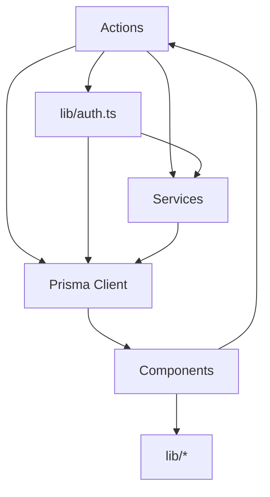

# Integrations

## External Services

### 1. Supabase (Primary Backend)
| Aspect | Details |
|--------|---------|
| **Service** | Supabase (PostgreSQL + Auth + Realtime + Storage) |
| **Region** | Configured via `NEXT_PUBLIC_SUPABASE_URL` |
| **Auth** | Email/Password, Magic Links, PKCE Flow |
| **Database** | PostgreSQL 15+ (via Supabase) |
| **Connection** | `@supabase/ssr` (SSR) + `@supabase/supabase-js` (client) |
| **Connection Pooling** | PgBouncer via `@prisma/adapter-pg` |
| **Migrations** | Prisma Migrate |
| **Auth Providers** | Email/Password, Magic Link (Email) |

**Configuration:**
```env
NEXT_PUBLIC_SUPABASE_URL=https://<project>.supabase.co
NEXT_PUBLIC_SUPABASE_ANON_KEY=<anon_key>
DATABASE_URL=postgresql://... (with pgbouncer)
```

**Auth Flow:**
- PKCE flow for email confirmation & password reset
- Callback: `/auth/callback?code=...&next=/reset-password`
- Server-side session via `@supabase/ssr` cookies
- Middleware: `updateSession()` on every request

---

### 2. Resend (Email Delivery)
| Aspect | Details |
|--------|---------|
| **Service** | Resend (via Supabase Custom SMTP) |
| **Purpose** | Transactional emails (confirmation, password reset) |
| **SMTP Host** | `smtp.resend.com` |
| **Port** | 465 (SSL) / 587 (STARTTLS) |
| **Auth** | `resend` / Resend API Key |
| **From Address** | Configured in Supabase Auth settings |

**Email Templates:**
- Signup confirmation (magic link)
- Password reset (recovery link)
- Invitation emails (future)

---

### 3. Resend (Direct - Optional Future)
| Aspect | Details |
|--------|---------|
| **Service** | Resend API (direct) |
| **Purpose** | Transactional emails, marketing (future) |
| **SDK** | `resend` npm package (not yet integrated) |
| **Webhooks** | Not yet configured |

---

### 4. AI/ML Integrations
| Service | Purpose | Status |
|---------|---------|--------|
| **OpenAI** | Document ingestion, CA Assistant chat | Implemented (`src/services/ai/ingest.ts`) |
| **Anthropic** | Future: Advanced analysis | Planned |
| **Local LLMs** | Privacy-sensitive processing | Planned |

**Current AI Features:**
- Document ingestion (PDF, images) → Structured data extraction
- CA Assistant chat (financial Q&A)
- Deterministic financial calculations (no LLM math)

---

### 5. Supabase Auth Webhooks
| Webhook | Purpose |
|---------|---------|
| `user.created` | Trigger `syncPrismaUser()` sync |
| `user.updated` | Sync profile changes |
| `user.deleted` | Cleanup (soft delete) |

**Configuration:** Supabase Dashboard → Auth → Webhooks

---

### 4. Resend (Email) - Production
| Setting | Value |
|---------|-------|
| **Domain** | Verified domain (configured in Resend) |
| **DKIM/DKIM** | Configured in Resend dashboard |
| **Webhooks** | `email.sent`, `email.delivered`, `email.bounced` |

---

### 5. Development Tools
| Tool | Purpose |
|------|---------|
| **Vercel** | Deployment (production) |
| **Vercel Preview** | Preview deployments |
| **Supabase Dashboard** | Database, Auth, Logs, Realtime |
| **Resend Dashboard** | Email logs, delivery tracking |
| **Vercel Analytics** | Web vitals (optional) |

---

## Internal Module Dependencies



---

## Environment-Specific Configuration

| Environment | Supabase Project | Database | Email |
|-------------|------------------|----------|-------|
| **Local** | Local Supabase / Cloud | Local PG / Cloud | Resend (test) |
| **LAN Test** | Cloud | Cloud | Resend (test) |
| **Production** | Production | Production | Production |

---

*Generated: 2026-09-17*